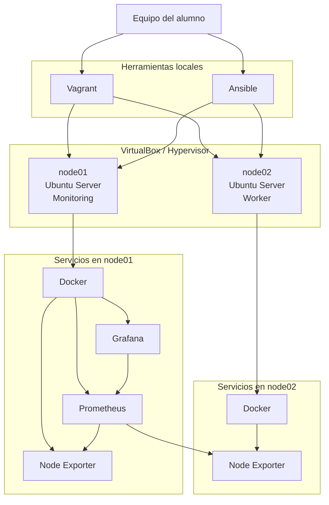

# Laboratorio de Administración Moderna de Sistemas Linux


### Automatización de infraestructuras mediante Vagrant, Ansible, Docker, Prometheus y Grafana


# Introducción

La administración de sistemas ha evolucionado enormemente durante los últimos años. Si antes era habitual crear servidores manualmente, instalar aplicaciones una a una y configurarlas directamente sobre cada máquina, hoy en día la mayor parte de las infraestructuras se gestionan mediante código, automatización y herramientas que permiten desplegar entornos completos de forma rápida, reproducible y consistente.

Este laboratorio propone un recorrido práctico por esa evolución.

A partir de dos máquinas virtuales Ubuntu recién creadas construiremos, paso a paso, una pequeña infraestructura moderna utilizando algunas de las tecnologías más empleadas actualmente en entornos profesionales de Administración de Sistemas y DevOps.

A lo largo de las distintas prácticas aprenderemos a:

- Crear infraestructura mediante **Vagrant**.
- Automatizar la configuración de servidores con **Ansible**.
- Desplegar aplicaciones utilizando **Docker**.
- Monitorizar sistemas con **Prometheus**.
- Visualizar métricas mediante **Grafana**.

Más que aprender herramientas concretas, el objetivo es comprender cómo todas ellas trabajan conjuntamente para construir infraestructuras reproducibles, automatizadas y fáciles de mantener.

> **Este laboratorio no pretende enseñar únicamente a utilizar Vagrant, Ansible o Docker, sino introducir una forma de trabajar basada en Infraestructura como Código (IaC), automatización y observabilidad, ampliamente utilizada en la administración moderna de sistemas.**

## ¿A quién va dirigido?

Este laboratorio está dirigido a estudiantes de Administración de Sistemas Operativos, Ingeniería Informática y a cualquier persona interesada en dar sus primeros pasos en la automatización de infraestructuras y la monitorización de sistemas Linux.

No es necesario tener conocimientos previos de Vagrant, Ansible, Docker, Prometheus o Grafana. Cada práctica introduce progresivamente los conceptos necesarios para completar el laboratorio y comprender el papel que desempeña cada tecnología dentro de una infraestructura moderna.


---

# Objetivo

Este laboratorio tiene como objetivo introducir al alumno en algunas de las tecnologías más utilizadas actualmente en entornos profesionales de administración de sistemas y DevOps.

A lo largo de las prácticas se construirá una pequeña infraestructura completamente reproducible y monitorizada utilizando:

- Vagrant
- Ansible
- Docker
- Prometheus
- Grafana

El laboratorio está pensado para ser realizado paso a paso, entendiendo el papel que desempeña cada herramienta dentro de una infraestructura moderna.

---

# ¿Qué aprenderás?

Al finalizar este laboratorio serás capaz de:

- Crear máquinas virtuales mediante **Infraestructura como Código (IaC)**.
- Automatizar la configuración de servidores Linux utilizando **Ansible**.
- Desplegar aplicaciones mediante **Docker**.
- Monitorizar sistemas Linux con **Prometheus**.
- Construir dashboards profesionales utilizando **Grafana**.
- Comprender cómo se integran todas estas tecnologías en un entorno real.

Además, todo el laboratorio puede destruirse y volver a desplegarse tantas veces como sea necesario, permitiendo experimentar sin riesgo sobre un entorno completamente aislado.

---

# Arquitectura del laboratorio



En esta arquitectura:

- **Vagrant** crea las máquinas virtuales.
- **VirtualBox** ejecuta dichas máquinas.
- **Ansible** configura los servidores.
- **Docker** ejecuta los servicios de monitorización.
- **Node Exporter** expone métricas de cada nodo.
- **Prometheus** recopila las métricas.
- **Grafana** visualiza la información mediante dashboards.

---

# Tecnologías utilizadas

| Tecnología | Función |
|------------|---------|
| Ubuntu Server 22.04 | Sistema operativo |
| VirtualBox | Hipervisor |
| Vagrant | Infraestructura como Código |
| Ansible | Automatización de configuración |
| Docker | Contenedores |
| Prometheus | Recopilación de métricas |
| Grafana | Visualización y dashboards |

---

# Requisitos

Para realizar este laboratorio es necesario disponer de las siguientes herramientas instaladas en el equipo anfitrión:

| Herramienta | Descripción |
|------------|-------------|
| Git | Descarga del repositorio y control de versiones. |
| VirtualBox | Hipervisor utilizado para ejecutar las máquinas virtuales. |
| Vagrant | Creación y gestión de la infraestructura virtual. |
| Ansible | Automatización de la configuración de los servidores. |

> **Nota:** Docker **no necesita estar instalado en el equipo anfitrión**, ya que será instalado automá

---

## Versiones utilizadas durante la validación

Este laboratorio ha sido probado con las siguientes versiones:

| Herramienta | Versión |
|------------|----------|
| Vagrant | 2.4.3 |
| VirtualBox | 7.1.12 |
| Ansible | 2.9.6 |
| Ubuntu Base Box | ubuntu/jammy64 |

No es necesario instalar plugins adicionales de Vagrant.


---

# Estructura del repositorio

```text
.
├── Vagrant/
│   └── Vagrantfile
│
├── ansible/
│   ├── inventory.ini
│   ├── playbooks/
│   └── templates/
│
├── grafana/
│   └── dashboards/
│       └── node-exporter-full.json
│
├── imgDoc/
│
├── docs/
│   ├── 01-vagrant.md
│   ├── 02-ansible.md
│   ├── 03-docker.md
│   ├── 04-monitoring.md
│   └── 05-grafana.md
│
└── README.md
```

---

# Guía del laboratorio

El laboratorio está dividido en seis prácticas independientes que deben realizarse en orden.


| Práctica | Descripción |
|----------|-------------|
| **01** | [Creación de la infraestructura con Vagrant](docs/01-vagrant.md) |
| **02** | [Automatización de la configuración con Ansible](docs/02-ansible.md) |
| **03** | [Instalación de Docker](docs/03-docker.md) |
| **04** | [Despliegue de la plataforma de monitorización](docs/04-monitoring.md) |
| **05** | [Configuración de Grafana](docs/05-grafana.md) |
| **06** | [Reiniciar el laboratorio](docs/06-reset-lab.md) |

Cada práctica explica:

- Una introducción a los conceptos fundamentales.
- Los comandos necesarios para completar la actividad.
- Explicaciones de las acciones realizadas.
- Comprobaciones para verificar el resultado esperado.

---

# Flujo del laboratorio

A lo largo de las prácticas construiremos progresivamente la siguiente arquitectura:

```text
Infraestructura
      │
      ▼
 Vagrant
      │
      ▼
 Máquinas Virtuales
      │
      ▼
 Ansible
      │
      ▼
 Docker
      │
      ▼
 Node Exporter
      │
      ▼
 Prometheus
      │
      ▼
 Grafana
```

Cada práctica añade una nueva capa sobre la anterior, reproduciendo el flujo habitual seguido en muchos proyectos reales de administración de sistemas.

---

# Resultado esperado

Al finalizar el laboratorio se dispondrá de:

- Dos servidores Ubuntu completamente configurados.
- Docker instalado en ambos nodos.
- Node Exporter desplegado en cada servidor.
- Prometheus recopilando métricas.
- Grafana mostrando dashboards de monitorización en tiempo real.


---

# ¿Por qué este laboratorio?

Este proyecto pretende acercar al alumno a un flujo de trabajo muy habitual en entornos profesionales.

En lugar de aprender cada herramienta por separado, el laboratorio muestra cómo todas ellas trabajan conjuntamente para construir una infraestructura moderna.

Se trabajan conceptos de:

- Infraestructura como Código (IaC).
- Automatización.
- Administración Linux.
- Contenedores.
- Observabilidad.
- Monitorización.

Todo ello utilizando herramientas Open Source ampliamente implantadas en la industria.

---

# Evolución del laboratorio

Este laboratorio constituye una base sólida para comprender cómo se construyen y administran infraestructuras modernas.

Las tecnologías utilizadas aquí son las mismas que se emplean en proyectos reales, aunque normalmente sustituyendo algunos componentes por soluciones más orientadas a entornos Cloud o de producción.

Algunos ejemplos de evolución natural serían:

| En este laboratorio | En un entorno profesional |
|----------------------|---------------------------|
| VirtualBox | VMware, Proxmox, AWS, Azure o Google Cloud |
| Vagrant | Terraform, OpenTofu o CloudFormation |
| Ubuntu Server | Máquinas virtuales o instancias Cloud |
| Ansible | Ansible AWX, Ansible Automation Platform o pipelines CI/CD |
| Docker | Kubernetes, OpenShift o Docker Swarm |
| Prometheus + Grafana | Plataformas completas de observabilidad (Prometheus, Grafana, Loki, Tempo, Mimir, etc.) |

Gracias a esta aproximación, el alumno no solo aprende a utilizar unas herramientas concretas, sino que adquiere una forma de trabajar basada en:

- Infraestructura como Código (IaC).
- Automatización de sistemas.
- Configuración declarativa.
- Contenedores.
- Observabilidad.
- Reproducibilidad de entornos.

Muchos de estos conceptos podrán reutilizarse posteriormente para desplegar infraestructuras en proveedores Cloud como AWS, Microsoft Azure o Google Cloud, automatizar clústeres Kubernetes o administrar plataformas empresariales de mayor complejidad.


---

# Autor

**Félix Centenera**

Proyecto desarrollado como propuesta de laboratorio para la asignatura de Ampliación de Sistemas Operativos, con el objetivo de introducir a los estudiantes en conceptos de Infraestructura como Código, automatización, contenedores y observabilidad mediante herramientas Open Source.

---

# Licencia

Este proyecto se distribuye bajo licencia **MIT**.