# 05 - Configuración de Grafana

## Objetivo

En esta última práctica configuraremos Grafana para visualizar las métricas almacenadas por Prometheus.

Al finalizar el laboratorio dispondremos de un dashboard completamente funcional que permitirá monitorizar ambos servidores desde una única interfaz web.

---

# Comprobar Prometheus

Antes de configurar Grafana, es recomendable comprobar que Prometheus está recopilando correctamente las métricas de ambos servidores.

Abrir una nueva pestaña del navegador y acceder a:

```text
http://192.168.56.11:9090
```

> **Figura 1.** Pantalla de inicio de sesión de Prometheus.

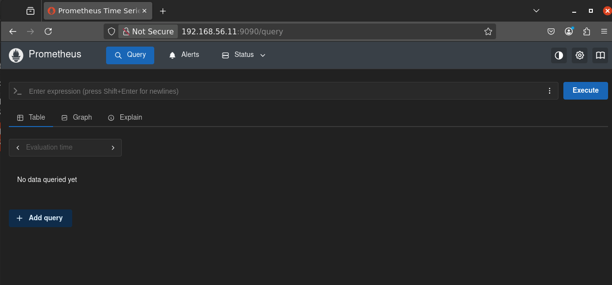

Verificar los Targets

Prometheus obtiene las métricas consultando periódicamente todos los servicios configurados.

Para comprobar que las conexiones son correctas acceder al menú:

```text
Status
    └── Target health
```

Deberán aparecer tres objetivos en estado UP:

Prometheus
Node Exporter (node01)
Node Exporter (node02)

Si alguno aparece en estado DOWN, Grafana no podrá mostrar correctamente las métricas.

> **Figura 2.** Pantalla de inicio de sesión de datasources Prometheus.

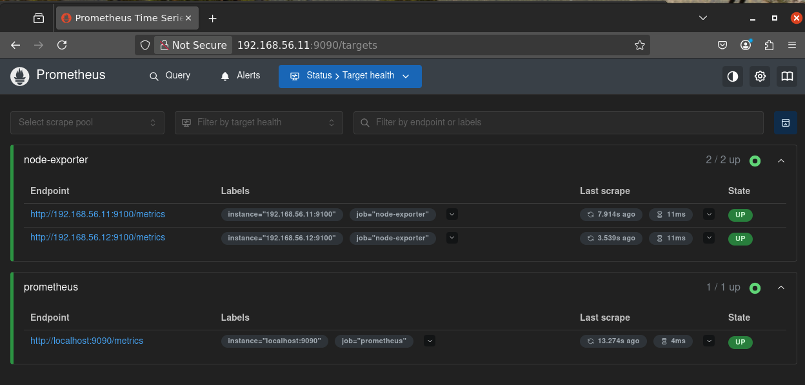

---
## Acceder a Grafana

Abrir el navegador y acceder a:

```text
http://192.168.56.11:3000
```

Iniciar sesión con las credenciales por defecto:

```text
Usuario: admin
Contraseña: admin
```

> **Figura 3.** Pantalla de inicio de sesión de Grafana.

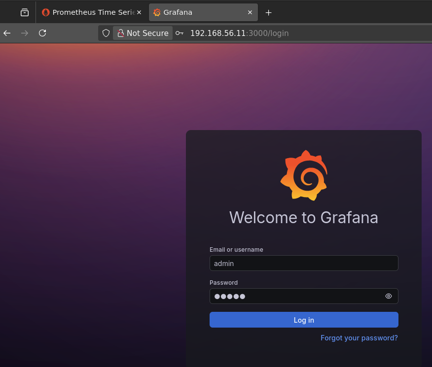

---

## Crear la fuente de datos

Una vez iniciada la sesión, Grafana todavía no conoce dónde se encuentran almacenadas las métricas.

Es necesario crear una **Data Source** apuntando a Prometheus.

Acceder al menú:

```text
Connections
    └── Data sources
```

> **Figura 4.** Pantalla inicial sin fuentes de datos configuradas.

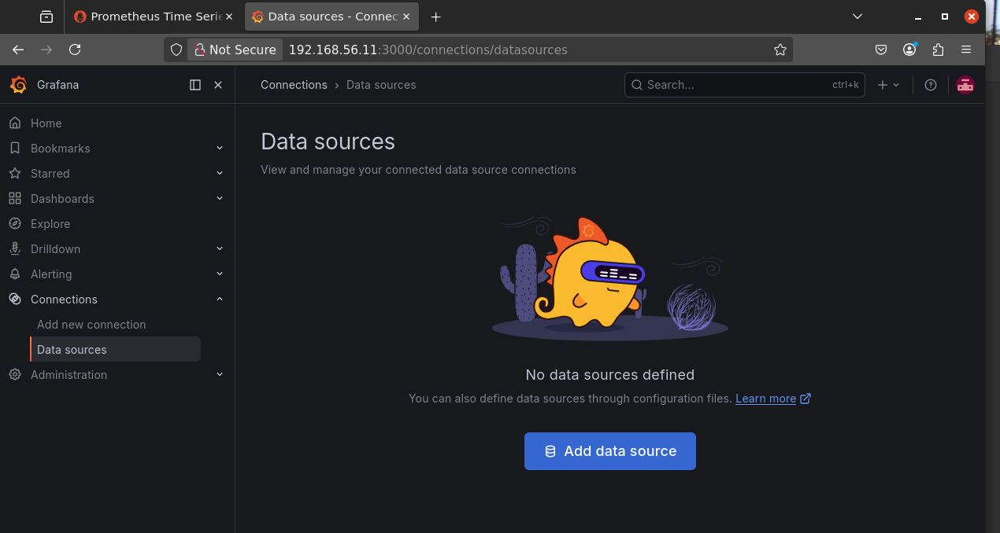


Pulsar:

```text
Add data source
```

> **Figura 5.** Selección del tipo de fuente de datos.

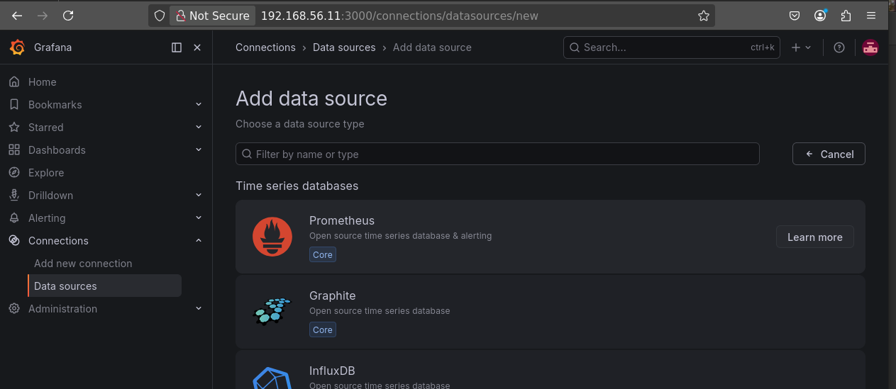

Seleccionar:

```text
Prometheus
```

---

## Configurar Prometheus

Introducir la siguiente dirección:

```text
http://prometheus:9090
```

¿Por qué no utilizamos la IP del servidor?

Porque Grafana y Prometheus se están ejecutando dentro de la misma red Docker y pueden comunicarse utilizando directamente el nombre del contenedor.

> **Figura 6.** Configuración de la fuente de datos.

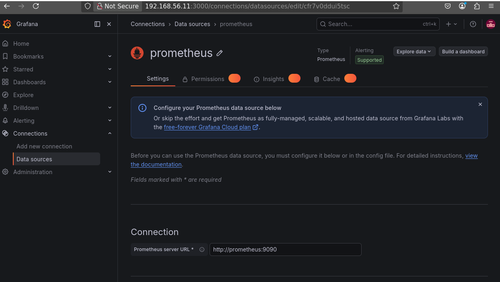

---

## Verificar la conexión

Desplazarse hasta el final de la página y pulsar:

```text
Save & Test
```

Si la configuración es correcta aparecerá el siguiente mensaje:

```text
Successfully queried the Prometheus API.
```

> **Figura 7.** Conexión correcta con Prometheus.

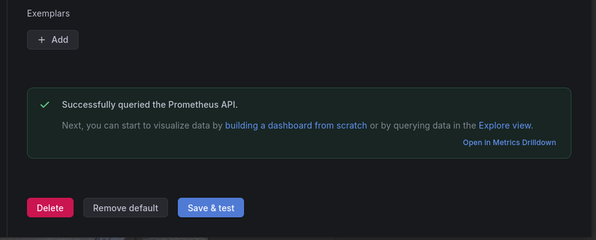

En este momento Grafana ya puede consultar las métricas almacenadas por Prometheus.

---

# Importar un Dashboard

Aunque ya disponemos de una fuente de datos, todavía no existe ningún panel de visualización.

En este laboratorio utilizaremos un dashboard creado por la comunidad para monitorizar servidores Linux mediante Node Exporter.

Acceder al menú:

```text
Dashboards
    └── Import dashboard
```

> **Figura 8.** Menú de importación de dashboards.

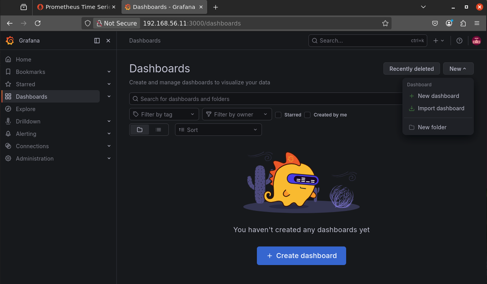

---

## Importar el fichero JSON

Dentro del repositorio se incluye el dashboard:

```text
grafana/dashboards/node-exporter-full.json
```

Seleccionar dicho fichero.

> **Figura 9.** Selección del dashboard.

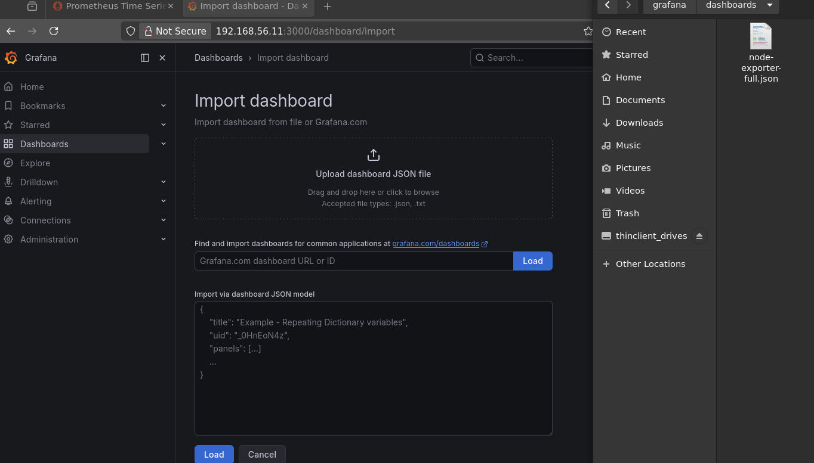


> **Figura 10.** Confirmación de la importación.

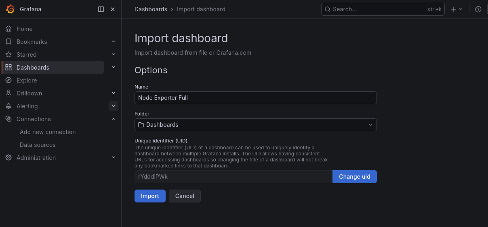

Una vez cargado, pulsar:

```text
Import
```


---

## Dashboard funcionando

Tras unos segundos aparecerá el dashboard completamente operativo.

> **Figura 11.** Dashboard de monitorización.

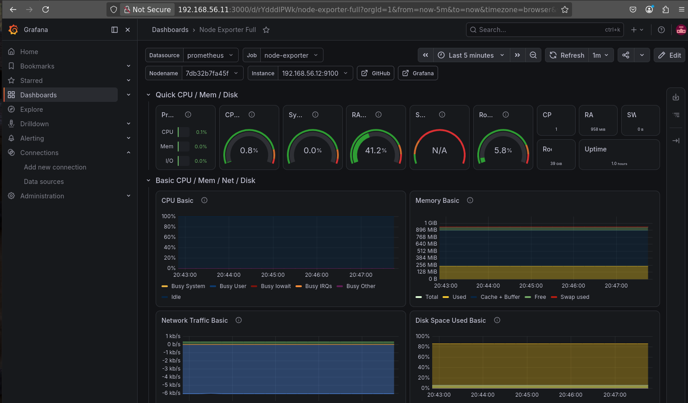


---

## Visualizar ambos servidores

El dashboard incorpora varias variables que permiten cambiar rápidamente el servidor monitorizado.

En la parte superior pueden seleccionarse:

- Job
- Node
- Instance

Esto permite alternar entre:

- node01
- node02

sin necesidad de crear varios dashboards.

> **Figura 12.** Selección del servidor monitorizado.

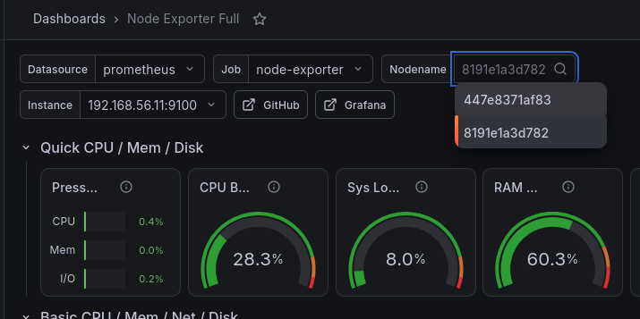

---

# ¿Qué estamos viendo?

Cada panel representa una métrica obtenida por Node Exporter y almacenada por Prometheus.

Algunos ejemplos son:

- Uso de CPU.
- Memoria utilizada.
- Espacio en disco.
- Tráfico de red.
- Carga del sistema.
- Tiempo de actividad (Uptime).
- Sistema de archivos.
- Procesos.

Todas estas métricas se actualizan automáticamente cada pocos segundos.

---

## Flujo completo de las métricas

Ahora ya podemos entender cómo viaja la información dentro del laboratorio.

```text
Servidor Linux
      │
      ▼
Node Exporter
      │
      ▼
Prometheus
      │
      ▼
Grafana
      │
      ▼
Dashboard
```

---

# Laboratorio completado

En este punto disponemos de una infraestructura completamente funcional formada por:

- Dos máquinas virtuales Ubuntu creadas con Vagrant.
- Configuración automatizada mediante Ansible.
- Docker instalado en ambos nodos.
- Node Exporter desplegado en cada servidor.
- Prometheus recopilando las métricas.
- Grafana mostrando dashboards interactivos.

A partir de este punto el alumno puede continuar ampliando el laboratorio desplegando nuevos servicios o creando dashboards personalizados.